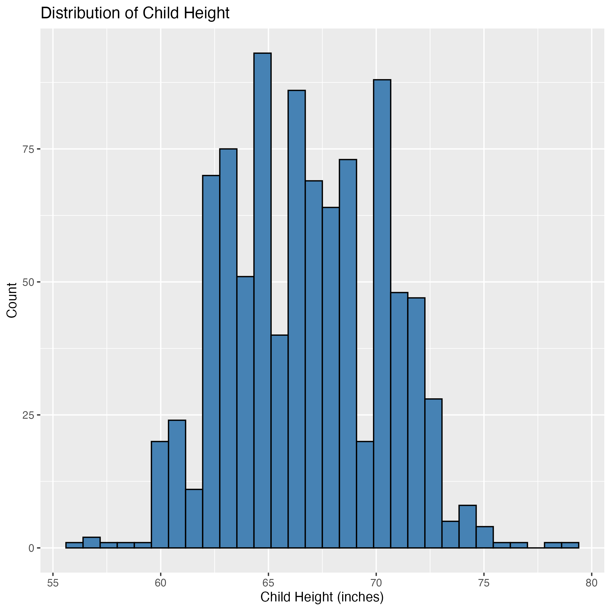
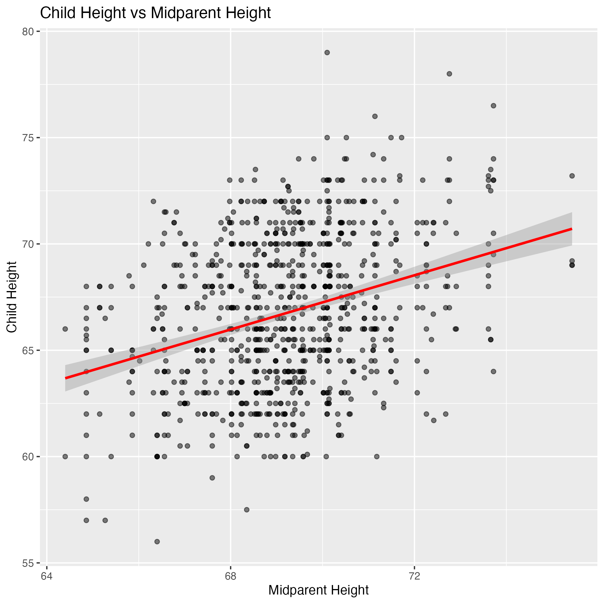
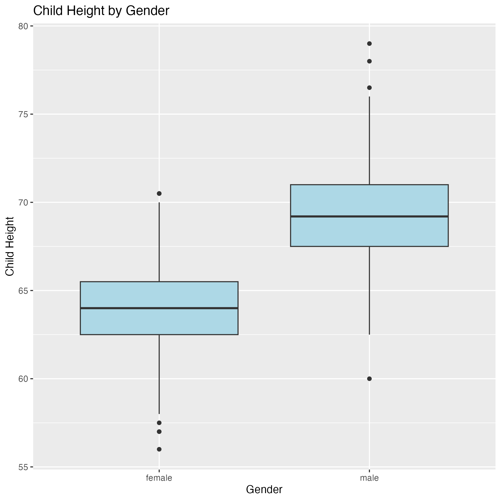
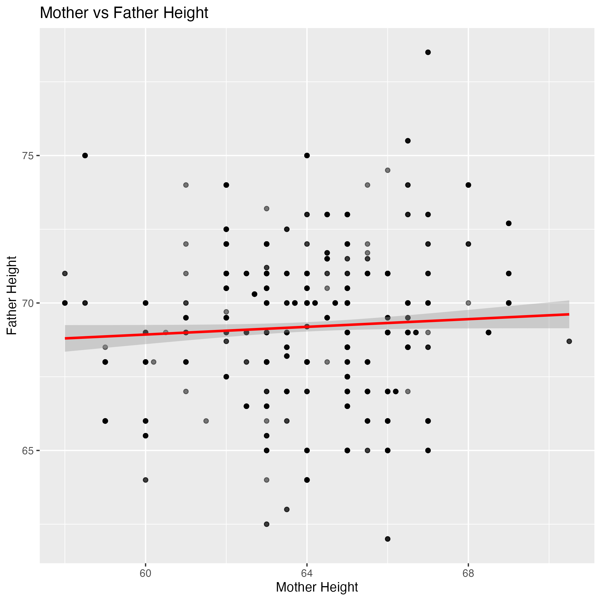
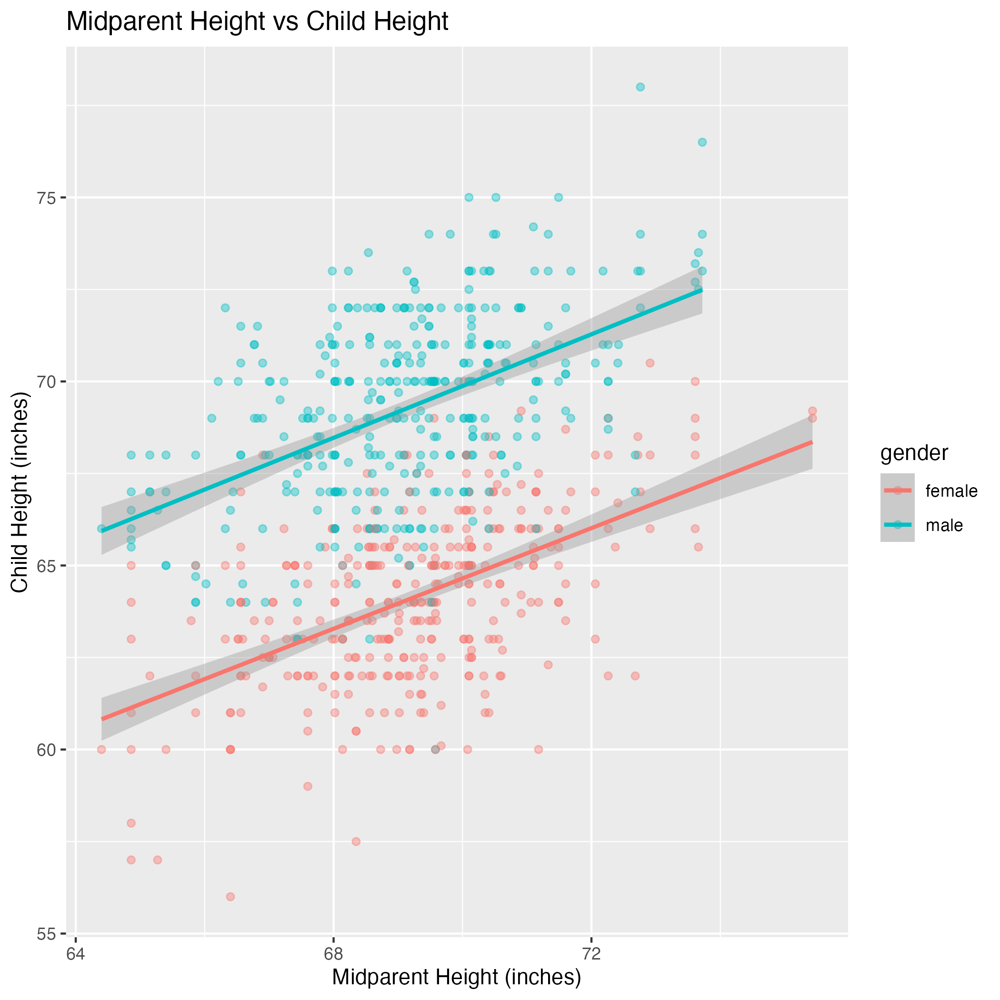

```{r}
#packages needed for this quarto document
#this cell will not appear when rendered

library(readr)
library(knitr)
```

# Predicting Child Height from Parental Height: A Linear Regression Analysis of the Galton Height Dataset

## Project Summary

```{r}
lm_test_results <- read_csv("../results/regression/regression_metrics.csv", show_col_types = FALSE)

rsq <- round(as.numeric(lm_test_results[2, '.estimate']),3)

```

Height is known to have a strong genetic component, and parental height is often used as a predictor of child height. In this analysis, we examined the relationship between midparent height (calculated as $(\text{father} + 1.08 \times \text{mother})/2$) and child height using the Galton height dataset. A multiple linear regression model was fitted to evaluate how well midparent height and child gender predict child height. The model was trained using 80% of the data and evaluated on the remaining 20% test set. The results indicated a significant positive relationship between the two variables, with midparent height explaining approximately `{r} rsq`of the variance in child height. These findings suggest that while parental height is an important factor, other genetic and environmental factors also contribute to a child's height.

## Introduction

Human height is influenced by a combination of genetic and environmental factors, but parental height is often considered a strong predictor of a child's height. Early statistical work by Francis Galton demonstrated that the average height of both parents, known as midparent height, provides a strong indicator of a child’s expected height [@galton1886regression]. Galton also observed that children’s heights tend to regress toward the population average rather than exactly matching their parents, a phenomenon later known as regression toward the mean. The Galton height dataset, collected in the late 19th century, contains measurements of parents’ heights and the heights of their children. The dataset includes a variable called midparent height, which is calculated as $(\text{father} + 1.08 \times \text{mother})/2$, adjusting for the typical height difference between men and women. This allows us to study how parental height relates to the height of their child. In this analysis, we aim to answer the question: **Can a child’s height be predicted based on their parents’ heights?** To address this question, we build a multiple linear regression model to examine the relationship between midparent height and child height while also accounting for the child’s gender. By fitting the model on a training dataset and evaluating its performance on a testing dataset, we assess how well parental height and gender together predict child height. This analysis provides a better understanding of how parental height contributes to variation in child height.

## Methods

To investigate the relationship between parental height and child height, we conducted a mutiple linear regression analysis using the Galton height dataset. The dataset was randomly split into training (80%) and testing (20%) sets. The training dataset was used to fit the regression model, while the testing dataset was used to evaluate the model's predictive performance.

A multiple linear regression model was fitted with child height as the response variable, and the midparent height and child gender as predictor variables.

## Dataset and Exploratory Data Analysis

```{r}
#im assuming script 01 already read in data via Makefile configuration

GaltonFamilies <- read_csv("../data/processed/galton_clean.csv", show_col_types = FALSE)

rows <- nrow(GaltonFamilies)
```

The GaltonFamilies dataset contains information about the heights of children and their parents from a number of families. Each row in the dataset represents one child, and there are `{r} rows` observations with 8 variables in total. The dataset includes variables such as the height of the father, the height of the mother, the calculated midparent height, the child’s gender, and the child’s height.

```{r}

#the inline code references 

mean_child_height <- round(as.numeric(summary(GaltonFamilies$child_height)['Mean']),2)
min_child_height <- round(as.numeric(summary(GaltonFamilies$child_height)['Min.']),2)
max_child_height <- round(as.numeric(summary(GaltonFamilies$child_height)['Max.']),2)

```

From the summary statistics, the average child height is about `{r} mean_child_height` inches, with heights ranging from `{r} min_child_height` inches to `{r} max_child_height` inches. The dataset also contains slightly more male children than female children. After checking for missing values, we found that there are no missing observations (@tbl-missing-values), meaning the dataset is complete and can be used directly for further analysis.

```{r}
#| label: tbl-missing-values
#| tbl-cap: "Number of missing values for each variable in the GaltonFamilies dataset."


missing_df <- read_csv("../results/eda/eda_missing.csv", show_col_types = FALSE)

kable(missing_df, format = "markdown")
```

{#fig-hist-child-height width="50%"}

@fig-hist-child-height explores the relationship between a child’s height and the midparent height. There is a clear positive trend, meaning that children with taller parents tend to be taller themselves. Although there is still variability in the data, the upward trend suggests that parental height is an important factor influencing a child's height. This relationship indicates that midparent height may be a useful predictor when building a model to estimate child height.

{#fig-scatter-parent-child-height width="50%"}

This scatterplot (@fig-scatter-parent-child-height) shows the relationship between the heights of mothers and fathers in the dataset. There appears to be a slight upward trend, suggesting that taller fathers tend to have somewhat taller partners as well. However, the points are still fairly spread out, so the relationship is not very strong. Because the two variables are somewhat related, using both mother and father height as predictors in a regression model could introduce a small amount of multicollinearity, meaning the variables may contain overlapping information about parental height.

{#fig-boxplot-gender-height width="50%"}

The boxplot (@fig-boxplot-gender-height) compares the distribution of child heights between males and females. We can see that male children tend to have a slightly higher median height than female children, although the distributions overlap considerably. Both groups also show a similar spread in heights. This suggests that while gender may play a role in determining height, it is likely only one of several factors influencing a child's height.

{#fig-scatter-mother-father-height width="50%"}

This scatterplot (@fig-scatter-mother-father-height) shows the relationship between the heights of mothers and fathers in the dataset. There appears to be a slight upward trend, suggesting that taller fathers tend to have somewhat taller partners as well. However, the points are still fairly spread out, so the relationship is not very strong. Because the two variables are somewhat related, using both mother and father height as predictors in a regression model could introduce a small amount of multicollinearity, meaning the variables may contain overlapping information about parental height.

## Results

```{r}
#| label: tbl-coefficients
#| tbl-cap: "Estimated coefficients from the multiple linear regression model predicting child height."


coefficients_df <- read_csv("../results/regression/regression_coefficients.csv", show_col_types = FALSE)

kable(coefficients_df, format = "markdown")
```

```{r}
#the inline text references for linear regression eqn above 

intercept <- round(as.numeric(coefficients_df[1,'estimate']),3)

midparent_height <- round(as.numeric(coefficients_df[2,'estimate']),3)
midparent_height_pvalue <-  round(as.numeric(coefficients_df[2,'p.value']),5)

gendermale <- round(as.numeric(coefficients_df[3,'estimate']),3)
gendermale_pvalue <-  round(as.numeric(coefficients_df[3,'p.value']),5)
```

The fitted regression model produced the following equation:

`r paste0("$\\text{Child Height} = ",            intercept, " + ",            midparent_height, " (\\text{Midparent Height}) + ",           gendermale, " (\\text{Male})$")`

The results indicate that midparent height is a significant predictor of child height (β = `{r} midparent_height`, p \< `{r} midparent_height_pvalue`). For every one inch increase in midparent height, the predicted child height increases by approximately `{r} midparent_height` inches.

Child gender was also a significant predictor (β = `{r} gendermale`, p \< `{r} gendermale_pvalue`). Male children were predicted to be approximately `{r} gendermale` inches taller than female children on average, when holding the midparent height constant.

```{r}
#| label: tbl-metrics
#| tbl-cap: "Test-set performance metrics for the multiple linear regression model."


#lm_test_results was defined above in first code chunk 

kable(lm_test_results, format = "markdown")

```

```{r}
#inline references for below
rmse <- round(as.numeric(lm_test_results[1, '.estimate']),2)
#rsp already defined above for project summary
mae <- as.numeric(lm_test_results[3, '.estimate'])
```

As displayed in @tbl-metrics, the model achieved a root mean squared error (RMSE) of `{r} rmse` inches and a mean absolute error (MAE) of `{r} sprintf("%.2f", mae)` inches, indicating that predictions were typically within approximately `{r} sprintf("%.0f", mae)` inches of the true child height. The model explained `{r} rsq`% of the variation in child height (R² = `{r} rsq`).

{#fig-model-plot width="50%"}

@fig-model-plot shows the relationship between midparent height and child height, with separate regression lines for male and female children. The positive slope for both lines indicates that taller parents tend to have taller children. The colour separation between male and female points in the scatterplot reflects the gender difference, with male children generally having greater predicted heights than female children at the same midparent height.

## Discussion

We found that midparent height had a positive relationship with their children's height. Gender also was a strong predictor of height, as male children were predicted to be approximately `{r} gendermale` inches taller than their female equivalents. Both variables were very statistically significant, with p-values less than `{r} gendermale_pvalue`.

The results are not surprising and are rather expected. Height is well recognized to have strong genetic components, and is largely hereditary and passed from parents to offspring. For example, the Tanner method [@tanner1970standards] estimates offspring height by averaging the adjusted height of the parents.

Our results align with existing research that examines the relationship between parental height and offspring height, such as Galton's original analysis in 1886. These findings have clear applications in healthcare and early disease detection. Being able to predict offspring height from parent height will allow healthcare providers to estimate expected heights for offspring, which can act as a baseline to gauge healthy growth and development.

##### Limitations

However, further research has recognized that height is also influenced by environmental factors, such as socio-economic status [@bozzoli2009adult] and the education level received by the parents [@jelenkovic2020genetic]. As our dataset only contains data regarding the parents' height, offspring height, and offspring gender, our model fails to capture other explanatory variables that are influential in determining offspring height.

Additionally, our model used multivariate regression as our primary supervised learning technique, which assumes linearity in the data. While it produced reasonable results, we have not tried other non-linear models, which may produce better results and capture non-linear patterns in our data.

The data itself may also contain bias and is non-representative of the global population. As the data was collected before 1886, it likely only contained data about English families and would not be an accurate representation of other demographics nor reflect modern improvements in dietary patterns, lifestyle, and societal norms.

Lastly, our dataset is relatively small with only 934 children. A larger dataset would allow for more sophisticated machine learning techniques such as larger train/test splits, cross-validation, and hyperparameter tuning.

##### Future Questions

Future areas to explore include re-examining the role of parental height and gender in predicting offspring height but with data collected recently, such as post 2000s across a global population. The role of birth order on height (i.e., first-born, second-born, etc.) and its interaction with gender and parents' height variables could also give insights into how family dynamics influence offspring height.

## References

::: {#refs}
:::
